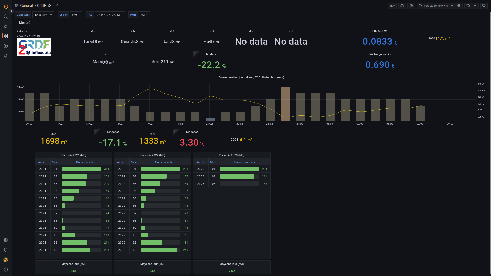

# grdf2influx2
Après récupération manuelle du fichier sur le site GRDF, les données sont transmises dans Influx2.0.
+ Un dashboard Grafana pour les visualiser

Tout ça largement inspiré par ce magnifique travail : [https://github.com/yukulehe/gazpar2mqtt](url)

# Information :

Les paramétres à adapter dans le fichier **grdf2influx.py**
#######################
# Variables à adapter #

# Chemin du fichier excel d'extraction GRDF le plus récent 
inputExcelFile = max(glob.glob('**/home/xxxx/Téléchargements**/Donnees_informatives_*.xlsx'))

# Doivent déja être créés dans influxdb  
# orga = 
# bucket =    
# token = 

url="**http://192.168.XXX.XXX:8086**"
orga = "**XXX**"
bucket = "**grdf**"
token = "**EVm2IG2G1mHMg5j52NIG2hKa60s1et-cxFOkG2hKajlJ6EaysrOwWwL2-98J9gQ==**"

prix_fixe = **0.690** # prix par jour de l'abonnement
prix_kwh = **0.0833** # prix du kwh

# Création du logguer Chemin  
logging.basicConfig(filename='**/home/XXXX/Téléchargements/grdf2influx2/releve.log**', level=logging.INFO, format='%(asctime)s %(message)s')
#######################


# Utilisation
Récuperer sur le site https://monespace.grdf.fr la consommation détaillée **par jour**


Puis 


Le fichier est téléchargé ( dans le dossier ~/Téléchargement)                  <--- **A Adapter ds les paramétres**.


Il suffit ensuite de lancer le script python : **grdf2influx2.py**

Il va utiliser le dernier fichier téléchargé et inserer dans le bucket les nouvelles données.

```:~/data_gaz$ ./grdf2influx2.py 
Début
Verification connection Influx... Connexion Influx >  Ok influx
Calcul coût
Premiere date du fichier: 07/03/2020
Derniere date enregistrée ds influx: 03/03/2023
Derniere date du fichier d'import :  03/03/2023
Terminé , 0 jours ajoutés.
```

Résultat dans grafana :



Je ne suis pas développeur.  
L’objectif de mes programmes ( des bricoles ), c’est de faire fonctionner le projet.  
Il y a probablement des quantités d'amélioration possible.  


